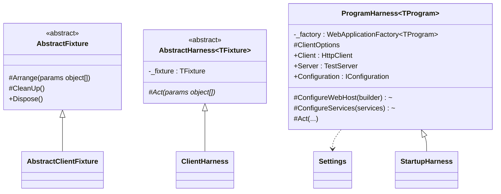
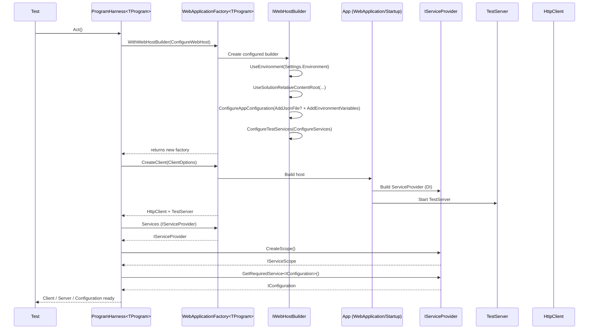
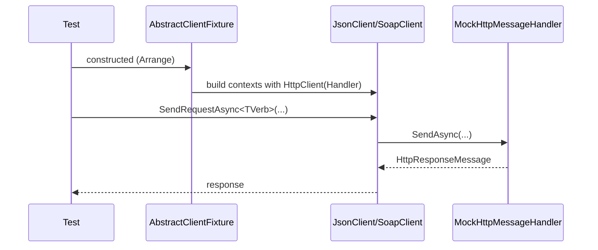

# Maurer.XUnit.Utilities

XUnit utility library that provides harness constructs for improved resource management, determinism, and speed for both classic unit testing and full in-memory integration testing.

[](https://github.com/OWNER/REPO/actions/workflows/build.yml)

[](LICENSE)

## Intent

Provide **reusable testing harnesses** that standardize two patterns:

1. **Fixture—Harness (Unit pattern)** — Create/own heavy resources once per suite with a deterministic `Arrange()` / `CleanUp()` lifecycle.
2. **Program-Startup Harness (Integration patterns)** — Boot an **in‑memory web app** for end‑to‑end tests using `WebApplicationFactory`, with stable env/config and optional service replacement.

Goals: **speed**, **determinism**, **clarity**, and **low boilerplate**.


## Table of Contents

- [Intent](#intent)
- [Dependencies](#dependencies)
- [Why use it?](#why-use-it)
- [When to Use](#when-to-use)
- [Components](#components)
- [Interactions](#interactions)
- [Outcomes](#outcomes)
- [Implementation Guide](#implementation-guide)
  - [Install packages](#install-packages)
  - [Minimal hosting (Program.cs)](#minimal-hosting-programcs)
  - [Startup-based apps](#startup-based-apps)
  - [Unit-test fixtures & harness](#unit-test-fixtures--harness)
  - [Parallel test safety](#parallel-test-safety)
  - [Customization hooks](#customization-hooks)
- [Quick reference](#quick-reference)
- [Troubleshooting](#troubleshooting)
- [Versioning & compatibility](#versioning--compatibility)
- [Example layout](#example-layout)

## Dependencies

- **.NET**: 8 or Higher
- **xUnit**
- **NuGet packages (test project)**

```xml
<ItemGroup>
  <PackageReference Include="Microsoft.AspNetCore.Mvc.Testing"    Version="8.0.*" />
  <PackageReference Include="Microsoft.AspNetCore.Hosting"        Version="2.*" />
  <PackageReference Include="Microsoft.AspNetCore.TestHost"       Version="8.0.*" />
  <PackageReference Include="ConfigMapFileProvider"               Version="2.0.1" />
  <PackageReference Include="xunit"                               Version="2.*" />
  <PackageReference Include="xunit.runner.visualstudio"           Version="2.*" />
</ItemGroup>
```

## Why use it?

- **Speed** — expensive fixtures are created once per suite.
- **Decomposition** — Seperate the fixtures that setup tests from the classes that run them.
- **Determinism** — explicit `Arrange()` and `CleanUp()` reduce flakiness.
- **Ergonomics** — ready `Client`, `Server`, and `Configuration` for integration tests.
- **Parity** — works with **minimal hosting (Program.cs)** and **legacy Startup.cs**.
- **Isolation** — per‑suite env/config via static `Settings` (with safety guidance).
- **Extensible** — narrow override points for host, services, and client options.

## When to Use

- You want to **pool and reuse resources and setup** to create **batteries** of tests.
- You create similar **HTTP clients/fakes** repeatedly in unit tests.
- You need **in‑memory hosting** to test endpoints end‑to‑end.
- You want a consistent **Arrange/Act** testing structure.
- You need to **swap app services** (DB, mailer, external HTTP) with test doubles.

## Components

### `AbstractFixture`
Base class that defines the **unit-test resource lifecycle**:
- `Arrange(params object[])` — construct resources.
- `CleanUp()` — teardown (called on dispose).
- Safe disposable pattern with finalizer.

### `AbstractHarness<TFixture>`
xUnit glue (`IClassFixture<TFixture>`). Holds the fixture and declares the suite’s **action** contract:
- `protected abstract Task Act(params object[] parameters);`

### `Settings` (static)
Test-time knobs for integration harness:
- `string Environment` — default `"Development"`.
- `string AppConfiguration` — optional JSON file name (skipped if empty).

### `ProgramHarness<TProgram>`
Integration wrapper around `WebApplicationFactory<TProgram>`:
- Works with **minimal hosting** out of the box (`Program.cs`).
- Works with **Startup** via override (`builder.UseStartup<T>()`).
- Exposes:
  - `HttpClient Client`
  - `TestServer Server`
  - `IConfiguration Configuration`
- Override points:
  - `ConfigureWebHost(IWebHostBuilder)` — env, content root, config providers, `ConfigureTestServices`.
  - `ConfigureServices(IServiceCollection)` — swap deps for tests.
  - `ClientOptions` — control redirects/base address, etc.
- `Act()` boots the in‑memory app and wires the properties.

### `StartupHarness<TProgram>`
Integration wrapper around `WebApplicationFactory<TProgram>` inherting off of `ProgramHarness<TProgram>`:
- Works with **Startup** via override of `ConfigureWebHost` (`builder.UseStartup<T>()`).
- Exposes:
  - `HttpClient Client`
  - `TestServer Server`
  - `IConfiguration Configuration`
- Override points:
  - `ConfigureWebHost(IWebHostBuilder)` — env, content root, config providers, `ConfigureTestServices`.
  - `ConfigureServices(IServiceCollection)` — swap deps for tests.
  - `ClientOptions` — control redirects/base address, etc.
- `Act()` boots the in‑memory app and wires the properties.

---

## Interactions

### Class relationships



### Sequence — Integration Testing (boot)



### Sequence — Software-Under-Test (client)



## Outcomes

**Benefits**

- Faster feedback loops.
- Less test boilerplate.
- Single harness for both hosting models.
- Clear override points; easier service swapping and config layering.

**Trade‑offs**

- `Settings` is static (see **Parallel test safety**).
- Integration tests still pay a per‑suite host startup cost.

## Implementation Guide

### Install packages

See [Dependencies](#dependencies) section for the `ItemGroup` snippet.

### Minimal hosting (Program.cs)

**Software Under Test (SUT) – Program.cs**  

Add at the bottom so tests can reference the entry point:
```csharp
public partial class Program { }
```

**Test – inherit the harness**

```csharp
using Microsoft.AspNetCore.Mvc.Testing;
using Maurer.XUnit.Utilities;
using Maurer.XUnit.Utilities.Web;
using Xunit;

public class WeatherApiTests : ProgramHarness<Program>
{
    private readonly (string Env, string? AppCfg) _snap;

    public WeatherApiTests(WebApplicationFactory<Program> factory) : base(factory)
    {
        _snap = (Settings.Environment, Settings.AppConfiguration);
        Settings.Environment      = "Development";
        Settings.AppConfiguration = "appsettings.Test.json";
    }

    [Fact]
    public async Task health_is_ok()
    {
        var resp = await Client.GetAsync("/health");
        resp.EnsureSuccessStatusCode();
    }
}
```

### Startup-based apps

If your app uses a `Startup` class you can use `StartupHarness`:

```csharp
using Microsoft.AspNetCore.Hosting;
using Microsoft.AspNetCore.Mvc.Testing;
using Maurer.XUnit.Utilities;
using Maurer.XUnit.Utilities.Web;
using Xunit;

public class LegacyApiTests : StartupHarness<MyApi.Startup>
{
    private readonly (string Env, string? AppCfg) _snap;

    public LegacyApiTests(WebApplicationFactory<MyApi.Startup> factory) : base(factory)
    {
        Act(); // boot once
    }

    protected override void ConfigureWebHost(IWebHostBuilder builder)
    {
        base.ConfigureWebHost(builder);
        builder.UseStartup<MyApi.Startup>(); // switch to Startup pipeline
    }

    [Fact]
    public async Task Health_is_ok()
    {
        var resp = await Client.GetAsync("/health");
        resp.EnsureSuccessStatusCode();
        Assert.Equal(HttpStatusCode.OK, resp.StatusCode);
    }
}
```

**Or** opt into that pipeline by overriding the web host from ProgramHarness:

```csharp
using Microsoft.AspNetCore.Hosting;
using Microsoft.AspNetCore.Mvc.Testing;
using Maurer.XUnit.Utilities;
using Maurer.XUnit.Utilities.Web;
using Xunit;

public class LegacyApiTests : StartupHarness<MyApi.Startup>
{
    private readonly (string Env, string? AppCfg) _snap;

    public LegacyApiTests(WebApplicationFactory<MyApi.Startup> factory) : base(factory)
    {
        Act(); // boot once
    }

    protected override void ConfigureWebHost(IWebHostBuilder builder)
    {
        //...stuff before...

        base.ConfigureWebHost(builder);
        
        //...stuff during...

        builder.UseStartup<MyApi.Startup>(); // switch to Startup pipeline

        //...stuff after...
    }

    [Fact]
    public async Task Health_is_ok()
    {
        var resp = await Client.GetAsync("/health");
        resp.EnsureSuccessStatusCode();
        Assert.Equal(HttpStatusCode.OK, resp.StatusCode);
    }
}
```

### Unit-test fixtures & harness

**Abstract fixture example**

```csharp
using System.Net;
using Maurer.XUnit.Utilities;
using Newtonsoft.Json;

public class AbstractClientFixture : AbstractFixture
{
    private MockHttpMessageHandler Mock(HttpStatusCode status, string payload) =>
        new MockHttpMessageHandler((_, __) =>
        {
            var res = new HttpResponseMessage(status)
            {
                Content = new StringContent(payload)
            };
            return Task.FromResult(res);
        });

    protected override void Arrange(params object[] _)
    {
        OKClient            = new HttpClient(Mock(HttpStatusCode.OK,          JsonConvert.SerializeObject(new object())));
        UnauthorizedClient  = new HttpClient(Mock(HttpStatusCode.Unauthorized, JsonConvert.SerializeObject(new object())));
        ForbiddenClient     = new HttpClient(Mock(HttpStatusCode.Forbidden,    JsonConvert.SerializeObject(new object())));
        ProxyRequiredClient = new HttpClient(Mock((HttpStatusCode)407,         JsonConvert.SerializeObject(new object())));
    }

    public HttpClient OKClient { get; protected set; } = default!;
    public HttpClient UnauthorizedClient { get; protected set; } = default!;
    public HttpClient ForbiddenClient { get; protected set; } = default!;
    public HttpClient ProxyRequiredClient { get; protected set; } = default!;
}
```

**Concrete fixtures (JSON/Soap)**

```csharp
public sealed class JsonClientFixture : AbstractClientFixture
{
    protected override void Arrange(params object[] p)
    {
        base.Arrange(p);
        OkContext            = new JsonClient(OKClient);
        UnauthorizedContext  = new JsonClient(UnauthorizedClient);
        ForbiddenContext     = new JsonClient(ForbiddenClient);
        ProxyRequiredContext = new JsonClient(ProxyRequiredClient);
    }

    public JsonClientFixture() => Arrange();
    public JsonClient OkContext { get; private set; } = default!;
    public JsonClient UnauthorizedContext { get; private set; } = default!;
    public JsonClient ForbiddenContext { get; private set; } = default!;
    public JsonClient ProxyRequiredContext { get; private set; } = default!;
}

public class SoapClientFixture : AbstractClientFixture
{
    protected override void Arrange(params object[] p)
    {
        base.Arrange(p);
        OkContext            = new SoapClient(OKClient);
        UnauthorizedContext  = new SoapClient(UnauthorizedClient);
        ForbiddenContext     = new SoapClient(ForbiddenClient);
        ProxyRequiredContext = new SoapClient(ProxyRequiredClient);
    }

    public SoapClientFixture() => Arrange();
    public SoapClient OkContext { get; private set; } = default!;
    public SoapClient UnauthorizedContext { get; private set; } = default!;
    public SoapClient ForbiddenContext { get; private set; } = default!;
    public SoapClient ProxyRequiredContext { get; private set; } = default!;
}
```

**Harness for client tests**

```csharp
using Maurer.XUnit.Utilities;
using Newtonsoft.Json;

public struct Person { public string Id { get; set; } public string Name { get; set; } }
public struct Payload { public string Token { get; set; } public string Json { get; set; } }

public class ClientHarness<TContext> : AbstractHarness<TContext> where TContext : AbstractClientFixture
{
    protected override Task Act(params object[] _) => Task.CompletedTask;

    protected Payload Payload { get; set; }

    public ClientHarness(TContext fixture) : base(fixture)
    {
        Payload = new Payload {
            Token = Guid.NewGuid().ToString(),
            Json = JsonConvert.SerializeObject(new Payload
            {
                Token = Guid.NewGuid().ToString(),
                Json = JsonConvert.SerializeObject(new Person { Id = Guid.NewGuid().ToString(), Name = "Person" })
            })
        };
    }
}
```

**Example test using JSON client**

```csharp
using System.Net;
using UnitTesting.MClient.Verbs;

public class UsingClient : ClientHarness<JsonClientFixture>
{
    public UsingClient(JsonClientFixture fixture) : base(fixture) { }

    [Fact]
    public async Task ShouldGetSuccessfully()
    {
        var response = await _fixture.OkContext.SendRequestAsync<Get>("https://test/index.html", Payload);
        Assert.True(response.IsSuccessStatusCode);
        Assert.Equal(HttpStatusCode.OK, response.StatusCode);
    }
}
```

### Parallel test safety

Because `Settings` is static, choose one:

**A) Snapshot/restore per suite**  

(see integration examples above), or

**B) Disable parallelization** for the test assembly:

```csharp
using Xunit;
[assembly: CollectionBehavior(DisableTestParallelization = true)]
```

### Customization hooks

- **Tune web host**:

  ```csharp
  protected override void ConfigureWebHost(IWebHostBuilder builder)
  {
      // Environment
      builder.UseEnvironment(string.IsNullOrWhiteSpace(Settings.Environment) ? "Development" : Settings.Environment);

      // Content root (adjust if needed)
      builder.UseSolutionRelativeContentRoot(AppDomain.CurrentDomain.BaseDirectory);

      // Configuration
      builder.ConfigureAppConfiguration((_, config) =>
      {
          if (!string.IsNullOrWhiteSpace(Settings.AppConfiguration))
          {
              config.AddJsonFile(
                  ConfigMapFileProvider.FromRelativePath(AppDomain.CurrentDomain.BaseDirectory),
                  Settings.AppConfiguration,
                  optional: true,
                  reloadOnChange: true);
          }
          config.AddEnvironmentVariables();
      });

      // Test services
      builder.ConfigureTestServices(ConfigureServices);
  }
  ```

- **Swap services**:

  ```csharp
  protected override void ConfigureServices(IServiceCollection services)
  {
      // services.RemoveAll<IMailer>();
      // services.AddSingleton<IMailer>(new FakeMailer());
  }
  ```

- **Adjust client**:

By default, redirects are not allowed and the base address is not defined in the ClientOptions:

  ```csharp
  virtual protected WebApplicationFactoryClientOptions ClientOptions => new()
  {
      AllowAutoRedirect = false,
      MaxAutomaticRedirections = 0
  };
  ```

This can be overridden in derived implementations:

  ```csharp
  override protected WebApplicationFactoryClientOptions ClientOptions => new()
  {
      AllowAutoRedirect = true,
      MaxAutomaticRedirections = 5,
      BaseAddress = new Uri("https://localhost")
  };
  ```

---

## Quick reference

| Task | How |
|---|---|
| Minimal hosting | Add `public partial class Program { }`, inherit `ProgramHarness<Program>` |
| Startup hosting | Override `ConfigureWebHost` and call `builder.UseStartup<Startup>()` |
| Add test config | `Settings.AppConfiguration = "appsettings.Test.json"` |
| Set environment | `Settings.Environment = "Development"` |
| Replace services | Override `ConfigureServices(IServiceCollection)` |
| Reuse resources | Put them in an `AbstractFixture` and consume via `AbstractHarness<TFixture>` |
| Avoid Settings collisions | Snapshot/restore or disable parallelization |

---

## Troubleshooting

- **Customizations not applied** — ensure you use the **returned** factory:
  ```csharp
  var factory = _factory.WithWebHostBuilder(ConfigureWebHost);
  Client = factory.CreateClient(ClientOptions);
  Server = factory.Server;
  ```
- **Wrong content root / 404 for static files** — override `ConfigureWebHost` and adjust content root.
- **Config file ignored** — set `Settings.AppConfiguration` and verify your `ConfigMapFileProvider` resolves the path you expect.
- **Service replacement not active** — ensure overrides happen in `ConfigureTestServices` and are not re-registered later by the app.

---

## Versioning & compatibility

- Target **.NET 8**. Keep `Microsoft.AspNetCore.*` package versions aligned with your target framework.
- Minimal hosting by default; Startup supported via the override hook.

---

## Example layout

```
/src
  /MyApi
    Program.cs
/tests
  /MyApi.Tests
    Settings.cs
    ProgramHarness.cs
    StartupHarness.cs
    AbstractFixture.cs
    AbstractHarness.cs
    Fixtures/
      AbstractClientFixture.cs
      JsonClientFixture.cs
      SoapClientFixture.cs
    Assertions/
      UsingJson/UsingClient.cs
      UsingSoap/UsingForbiddenClient.cs
    README.md
```